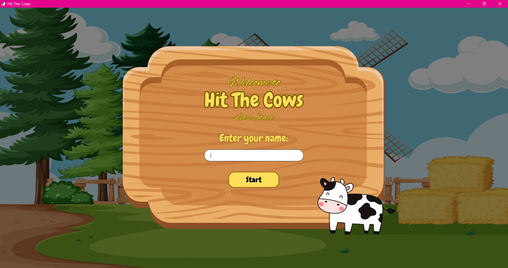
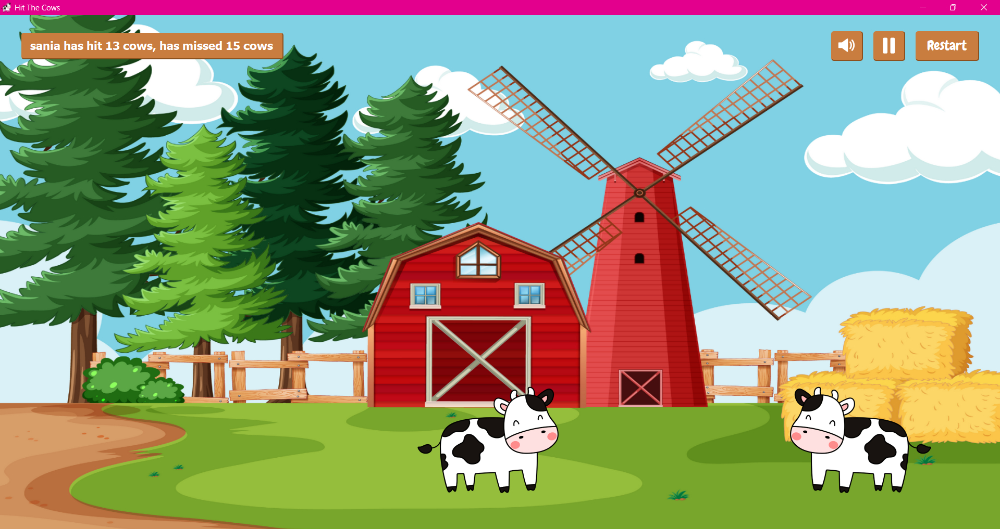
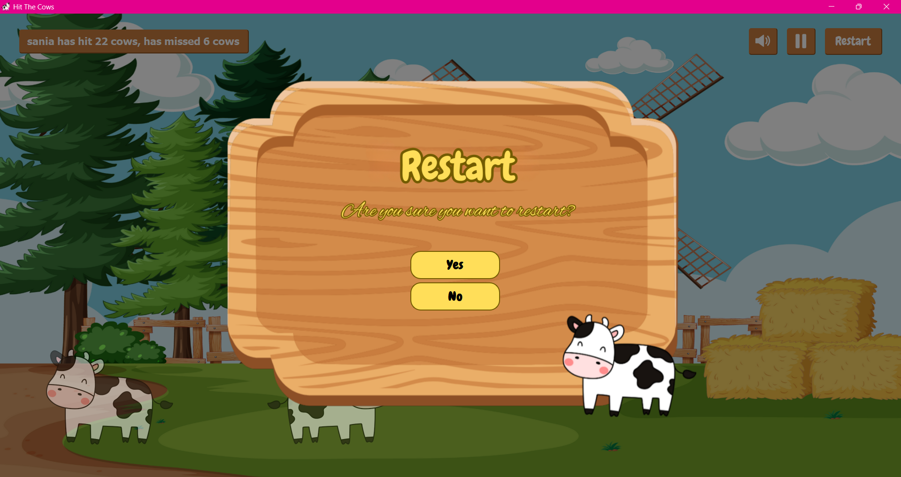
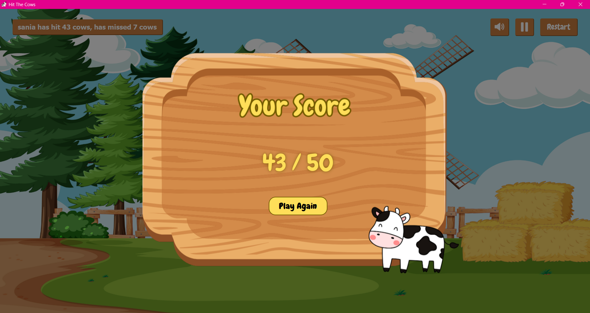

# 🐄 Hit The Cow — A Fast-Reaction Desktop Game
A Python desktop game built using PyQt5, where cows run across the screen and the player must tap them before they escape!
## Features
- Smooth left-to-right and right-to-left cow animations
- Increasing difficulty as cows speed up
- Responsive UI
- Sound effects with mute/unmute
- Pause, Resume, and Restart options
- Scoreboard system
## Technologies Used
- Python
- PyQT5 (UI and animations)
- Pygame (Sound)
## Screenshots
<table>
  <tr>
    <td></td>
    <td></td>
    <td></td>
    <td></td>
  </tr>
</table>

## How to Run
### 1. Clone the repository
```bash
git clone https://github.com/saniamirza03/Hit-The-Cows.git
cd Hit-The-Cows
```

### 2. Installation
- Install PyQt5 for UI display
- Install Pygame for Sound
```bash
pip install PyQt5
pip install pygame
```

### 3. Run the game
```bash
python main4.py
```
